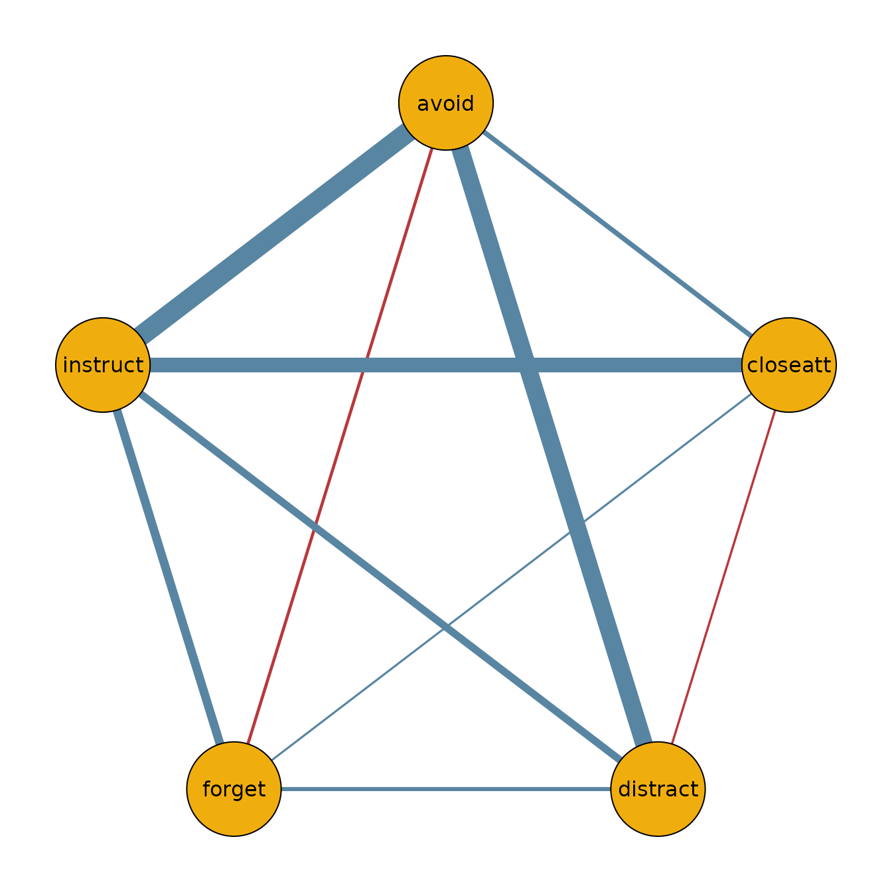

# Model Comparison with bgmCompare

## Introduction

The function
[`bgmCompare()`](https://bayesian-graphical-modelling-lab.github.io/bgms/reference/bgmCompare.md)
extends
[`bgm()`](https://bayesian-graphical-modelling-lab.github.io/bgms/reference/bgm.md)
to independent-sample designs. It estimates whether edge weights and
category thresholds differ across groups in an ordinal Markov random
field (MRF).

Posterior inclusion probabilities indicate how plausible it is that a
group difference exists in a given parameter. These can be converted to
Bayes factors for hypothesis testing.

## ADHD dataset

We illustrate with a subset from the `ADHD` dataset included in
**bgms**.

``` r
library(bgms)

?ADHD
data_adhd = ADHD[ADHD$group == 1, -1]
data_adhd = data_adhd[, 1:5]
data_no_adhd = ADHD[ADHD$group == 0, -1]
data_no_adhd = data_no_adhd[, 1:5]
```

## Fitting a model

``` r
fit = bgmCompare(x = data_adhd, y = data_no_adhd, seed = 1234)
```

## Posterior summaries

The summary shows both baseline effects and group differences:

``` r
summary(fit)
#> Posterior summaries from Bayesian grouped MRF estimation (bgmCompare):
#> 
#> Category thresholds:
#>      parameter   mean  mcse    sd    n_eff  Rhat
#> 1    avoid (1) -2.570 0.012 0.389 1000.548 1.001
#> 2 closeatt (1) -2.255 0.011 0.372 1058.581 1.013
#> 3 distract (1) -0.450 0.013 0.330  650.281 1.000
#> 4   forget (1) -1.540 0.011 0.326  860.980 1.002
#> 5 instruct (1) -2.334 0.014 0.394  790.011 1.005
#> 
#> Pairwise interactions:
#>           parameter   mean  mcse    sd    n_eff  Rhat
#> 1    avoid-closeatt  0.811 0.017 0.445  700.771 1.002
#> 2    avoid-distract  1.622 0.012 0.372 1010.162 1.000
#> 3      avoid-forget  0.478 0.012 0.363  846.177 1.000
#> 4    avoid-instruct  0.381 0.014 0.431  989.191 1.003
#> 5 closeatt-distract -0.168 0.011 0.359 1155.071 1.006
#> 6   closeatt-forget  0.153 0.008 0.293 1373.018 1.001
#> ... (use `summary(fit)$pairwise` to see full output)
#> 
#> Inclusion probabilities:
#>                  parameter  mean  mcse    sd n0->0 n0->1 n1->0 n1->1
#>               avoid (main) 1.000       0.000     0     0     0  1999
#>  avoid-closeatt (pairwise) 0.696 0.018 0.460   397   210   211  1181
#>  avoid-distract (pairwise) 0.386 0.012 0.487   803   425   424   347
#>    avoid-forget (pairwise) 0.861 0.014 0.346   165   113   113  1608
#>  avoid-instruct (pairwise) 0.996 0.002 0.067     4     5     5  1985
#>            closeatt (main) 1.000       0.000     0     0     0  1999
#>  n_eff_mixt  Rhat
#>                  
#>     662.308 1.001
#>    1623.275     1
#>     618.031 1.001
#>     774.056 1.126
#>                  
#> ... (use `summary(fit)$indicator` to see full output)
#> Note: NA values are suppressed in the print table. They occur when an indicator
#> was constant or had fewer than 5 transitions, so n_eff_mixt is unreliable;
#> `summary(fit)$indicator` still contains all computed values.
#> 
#> Group differences (main effects):
#>            parameter   mean mcse    sd   n_eff n_eff_mixt  Rhat
#>     avoid (diff1; 1) -2.585      0.738 822.680            1.001
#>  closeatt (diff1; 1) -2.884      0.719 850.621            1.000
#>  distract (diff1; 1) -2.592      0.671 588.723            1.000
#>    forget (diff1; 1) -2.878      0.642 646.747            1.002
#>  instruct (diff1; 1) -2.386      0.893 521.021            1.000
#> Note: NA values are suppressed in the print table. They occur here when an
#> indicator was zero across all iterations, so mcse/n_eff/n_eff_mixt/Rhat are undefined;
#> `summary(fit)$main_diff` still contains the NA values.
#> 
#> Group differences (pairwise effects):
#>                  parameter   mean  mcse    sd    n_eff n_eff_mixt
#>     avoid-closeatt (diff1)  0.948 0.032 0.865  568.814    724.944
#>     avoid-distract (diff1)  0.211 0.012 0.355  932.378    938.052
#>       avoid-forget (diff1)  1.281 0.029 0.796  579.667    764.262
#>     avoid-instruct (diff1) -2.745 0.034 0.990  782.659    827.328
#>  closeatt-distract (diff1) -0.159 0.012 0.324  974.294    741.833
#>    closeatt-forget (diff1)  0.164 0.012 0.324 1029.198    755.929
#>   Rhat
#>  1.004
#>  1.001
#>  1.000
#>  1.003
#>  1.007
#>  1.001
#> ... (use `summary(fit)$pairwise_diff` to see full output)
#> Note: NA values are suppressed in the print table. They occur here when an
#> indicator was zero across all iterations, so mcse/n_eff/n_eff_mixt/Rhat are undefined;
#> `summary(fit)$pairwise_diff` still contains the NA values.
#> 
#> Use `summary(fit)$<component>` to access full results.
#> See the `easybgm` package for other summary and plotting tools.
```

You can extract posterior means and inclusion probabilities:

``` r
coef(fit)
#> $main_effects_raw
#>                baseline     diff1
#> avoid(c1)    -2.5698070 -2.585211
#> closeatt(c1) -2.2549973 -2.884102
#> distract(c1) -0.4500195 -2.592396
#> forget(c1)   -1.5397695 -2.878431
#> instruct(c1) -2.3342186 -2.385729
#> 
#> $pairwise_effects_raw
#>                     baseline      diff1
#> avoid-closeatt     0.8106540  0.9480407
#> avoid-distract     1.6217536  0.2109026
#> avoid-forget       0.4775235  1.2813476
#> avoid-instruct     0.3808413 -2.7450407
#> closeatt-distract -0.1679917 -0.1589278
#> closeatt-forget    0.1531440  0.1642686
#> closeatt-instruct  1.4875764  0.4870774
#> distract-forget    0.3755528  0.2333754
#> distract-instruct  1.1930973  1.2431688
#> forget-instruct    1.0594628  0.7473659
#> 
#> $main_effects_groups
#>                  group1    group2
#> avoid(c1)    -1.2772013 -3.862413
#> closeatt(c1) -0.8129461 -3.697048
#> distract(c1)  0.8461783 -1.746217
#> forget(c1)   -0.1005540 -2.978985
#> instruct(c1) -1.1413540 -3.527083
#> 
#> $pairwise_effects_groups
#>                        group1     group2
#> avoid-closeatt     0.33663370  1.2846744
#> avoid-distract     1.51630235  1.7272049
#> avoid-forget      -0.16315030  1.1181973
#> avoid-instruct     1.75336163 -0.9916790
#> closeatt-distract -0.08852775 -0.2474556
#> closeatt-forget    0.07100968  0.2352783
#> closeatt-instruct  1.24403770  1.7311151
#> distract-forget    0.25886514  0.4922405
#> distract-instruct  0.57151284  1.8146817
#> forget-instruct    0.68577985  1.4331458
#> 
#> $indicators
#>           avoid closeatt distract forget instruct
#> avoid    1.0000   0.6960   0.3860  0.861   0.9955
#> closeatt 0.6960   1.0000   0.3835  0.392   0.5360
#> distract 0.3860   0.3835   1.0000  0.401   0.8335
#> forget   0.8610   0.3920   0.4010  1.000   0.7110
#> instruct 0.9955   0.5360   0.8335  0.711   1.0000
```

## Visualizing group networks

We can use the output to plot the network for the ADHD group:

``` r
library(qgraph)

adhd_network = matrix(0, 5, 5)
adhd_network[lower.tri(adhd_network)] = coef(fit)$pairwise_effects_groups[, 1]
adhd_network = adhd_network + t(adhd_network)
colnames(adhd_network) = colnames(data_adhd)
rownames(adhd_network) = colnames(data_adhd)

qgraph(adhd_network,
  theme = "TeamFortress",
  maximum = 1,
  fade = FALSE,
  color = c("#f0ae0e"), vsize = 10, repulsion = .9,
  label.cex = 1, label.scale = "FALSE",
  labels = colnames(data_adhd)
)
```



## Next steps

- For a one-sample analysis, see the *Getting Started* vignette.
- For diagnostics and convergence checks, see the *Diagnostics*
  vignette.
- For additional analysis tools and more advanced plotting options,
  consider using the **easybgm** package, which integrates smoothly with
  **bgms** objects.
