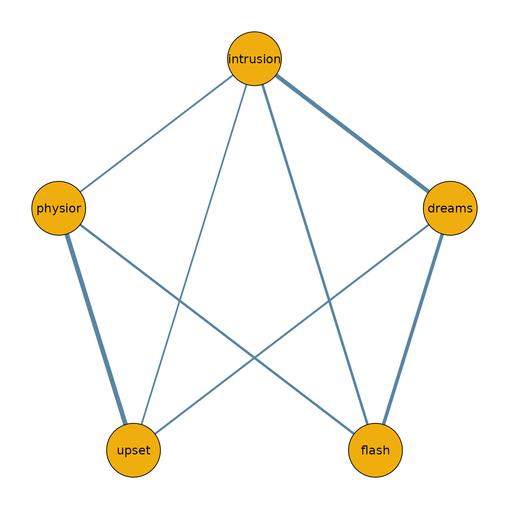

# Getting Started with bgms

## Introduction

The **bgms** package implements Bayesian methods for analyzing graphical
models. It supports three variable types:

- **ordinal** (including binary) — Markov random field (MRF) models,
- **Blume–Capel** — ordinal MRF with a reference category,
- **continuous** — Gaussian graphical models (GGM).

The package estimates main effects and pairwise interactions, with
optional Bayesian edge selection via spike-and-slab priors. It provides
two main entry points:

- [`bgm()`](https://bayesian-graphical-modelling-lab.github.io/bgms/reference/bgm.md)
  for one-sample designs (single network),
- [`bgmCompare()`](https://bayesian-graphical-modelling-lab.github.io/bgms/reference/bgmCompare.md)
  for independent-sample designs (group comparisons).

This vignette walks through the basic workflow for ordinal data. For
continuous data, set `variable_type = "continuous"` in
[`bgm()`](https://bayesian-graphical-modelling-lab.github.io/bgms/reference/bgm.md)
to fit a Gaussian graphical model.

## Wenchuan dataset

The dataset `Wenchuan` contains responses from survivors of the 2008
Wenchuan earthquake on posttraumatic stress items. Here, we analyze a
subset of the first five items as a demonstration.

``` r
library(bgms)

# Analyse a subset of the Wenchuan dataset
?Wenchuan
data = Wenchuan[, 1:5]
head(data)
#>      intrusion dreams flash upset physior
#> [1,]         2      2     2     2       3
#> [2,]         2      2     2     3       3
#> [3,]         2      4     4     4       3
#> [4,]         2      1     2     2       1
#> [5,]         2      2     2     2       2
#> [6,]         4      3     2     2       2
```

## Fitting a model

The main entry point is
[`bgm()`](https://bayesian-graphical-modelling-lab.github.io/bgms/reference/bgm.md)
for single-group models and
[`bgmCompare()`](https://bayesian-graphical-modelling-lab.github.io/bgms/reference/bgmCompare.md)
for multiple-group comparisons.

``` r
fit = bgm(data, seed = 1234)
```

## Posterior summaries

``` r
summary(fit)
#> Posterior summaries from Bayesian estimation:
#> 
#> Category thresholds: 
#>                 mean  mcse    sd    n_eff  Rhat
#> intrusion (1)  0.493 0.010 0.235  608.711 1.001
#> intrusion (2) -1.867 0.019 0.362  352.495 1.002
#> intrusion (3) -4.776 0.041 0.597  212.756 1.002
#> intrusion (4) -9.419 0.056 0.967  298.267 1.002
#> dreams (1)    -0.603 0.006 0.201 1049.614 1.002
#> dreams (2)    -3.809 0.013 0.363  827.265 1.006
#> ... (use `summary(fit)$main` to see full output)
#> 
#> Pairwise interactions:
#>                    mean    sd  mcse    n_eff  Rhat
#> intrusion-dreams  0.317 0.001 0.035 1173.359 1.003
#> intrusion-flash   0.168 0.001 0.032 1210.151 1.005
#> intrusion-upset   0.089 0.044 0.006   60.228 1.018
#> intrusion-physior 0.102 0.034 0.002  185.928 1.007
#> dreams-flash      0.250 0.001 0.030 1364.041 1.003
#> dreams-upset      0.118 0.001 0.028  425.029 1.004
#> ... (use `summary(fit)$pairwise` to see full output)
#> Note: NA values are suppressed in the print table. They occur here when an 
#> indicator was zero across all iterations, so mcse/n_eff/Rhat are undefined;
#> `summary(fit)$pairwise` still contains the NA values.
#> 
#> Inclusion probabilities:
#>                    mean    sd  mcse n0->0 n0->1 n1->0 n1->1  n_eff
#> intrusion-dreams  1.000 0.000           0     0     0  1999       
#> intrusion-flash   1.000 0.000           0     0     0  1999       
#> intrusion-upset   0.865 0.342 0.054   261     9    10  1719 39.897
#> intrusion-physior 0.971 0.169  0.02    55     4     4  1936 72.387
#> dreams-flash      1.000 0.000           0     0     0  1999       
#> dreams-upset      1.000 0.000           0     0     0  1999       
#>                    Rhat
#> intrusion-dreams       
#> intrusion-flash        
#> intrusion-upset   1.114
#> intrusion-physior 1.262
#> dreams-flash           
#> dreams-upset           
#> ... (use `summary(fit)$indicator` to see full output)
#> Note: NA values are suppressed in the print table. They occur when an indicator
#> was constant (all 0 or all 1) across all iterations, so sd/mcse/n_eff/Rhat
#> are undefined; `summary(fit)$indicator` still contains the NA values.
#> 
#> Use `summary(fit)$<component>` to access full results.
#> See the `easybgm` package for other summary and plotting tools.
```

You can also access posterior means or inclusion probabilities directly:

``` r
coef(fit)
#> $main
#>               cat (1)   cat (2)   cat (3)    cat (4)
#> intrusion  0.49326700 -1.867211 -4.776173  -9.419060
#> dreams    -0.60296934 -3.809193 -7.157296 -11.619584
#> flash     -0.08231884 -2.521328 -5.294346  -9.549557
#> upset      0.43646983 -1.273984 -3.316790  -6.947837
#> physior   -0.60903137 -3.170420 -6.221435 -10.578263
#> 
#> $pairwise
#>            intrusion      dreams       flash       upset     physior
#> intrusion 0.00000000 0.316707142 0.167709696 0.088672349 0.101880020
#> dreams    0.31670714 0.000000000 0.249884872 0.118073148 0.001072865
#> flash     0.16770970 0.249884872 0.000000000 0.001168627 0.152192873
#> upset     0.08867235 0.118073148 0.001168627 0.000000000 0.355534822
#> physior   0.10188002 0.001072865 0.152192873 0.355534822 0.000000000
#> 
#> $indicator
#>           intrusion dreams flash  upset physior
#> intrusion    0.0000  1.000 1.000 0.8645  0.9705
#> dreams       1.0000  0.000 1.000 1.0000  0.0260
#> flash        1.0000  1.000 0.000 0.0230  1.0000
#> upset        0.8645  1.000 0.023 0.0000  1.0000
#> physior      0.9705  0.026 1.000 1.0000  0.0000
```

## Network plot

To visualize the network structure, we threshold the posterior inclusion
probabilities at 0.5 and plot the resulting adjacency matrix.

``` r
library(qgraph)

median_probability_network = coef(fit)$pairwise
median_probability_network[coef(fit)$indicator < 0.5] = 0.0

qgraph(median_probability_network,
  theme = "TeamFortress",
  maximum = 1,
  fade = FALSE,
  color = c("#f0ae0e"), vsize = 10, repulsion = .9,
  label.cex = 1, label.scale = "FALSE",
  labels = colnames(data)
)
```



## Continuous data (GGM)

For continuous variables,
[`bgm()`](https://bayesian-graphical-modelling-lab.github.io/bgms/reference/bgm.md)
fits a Gaussian graphical model when `variable_type = "continuous"`. The
workflow is the same:

``` r
fit_ggm = bgm(continuous_data, variable_type = "continuous", seed = 1234)
summary(fit_ggm)
```

The pairwise effects are partial correlations (off-diagonal entries of
the standardized precision matrix). Missing values can be imputed during
sampling with `na_action = "impute"`.

## Next steps

- For comparing groups, see
  [`?bgmCompare`](https://bayesian-graphical-modelling-lab.github.io/bgms/reference/bgmCompare.md)
  or the *Model Comparison* vignette.
- For diagnostics and convergence checks, see the *Diagnostics*
  vignette.
